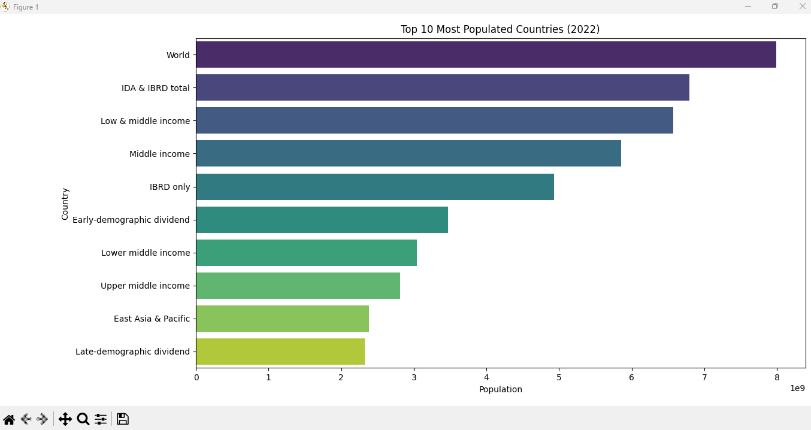

# CodeCraft Data Science Internship – Task 01

## 🎯 Task Objective
Create a bar chart or histogram to visualize the distribution of a categorical or continuous variable (e.g., population).

## 📂 Files Included
- `task01_population_bar_chart.py` – Bar chart of top 10 most populated countries (2022).
- `task01_population_histogram.py` – Histogram showing population distribution across countries.
- 3 CSV files from World Bank:
  - `API_SP.POP.TOTL_DS2_en_csv_v2_19373.csv`
  - `Metadata_Country_API_SP.POP.TOTL_DS2_en_csv_v2_19373.csv`
  - `Metadata_Indicator_API_SP.POP.TOTL_DS2_en_csv_v2_19373.csv`

## 🛠️ Tools & Libraries Used
- Python
- Pandas
- Seaborn
- Matplotlib

## 📈 Outputs
- Bar Chart: Top 10 most populated countries in 2022.

- Histogram: Population distribution among countries in 2022.

## 📌 Dataset Source
World Bank – [Total Population Dataset](https://data.worldbank.org/indicator/SP.POP.TOTL)

## ✅ Status
Task 01 Completed ✅
