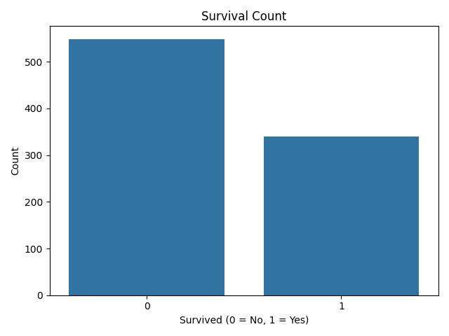
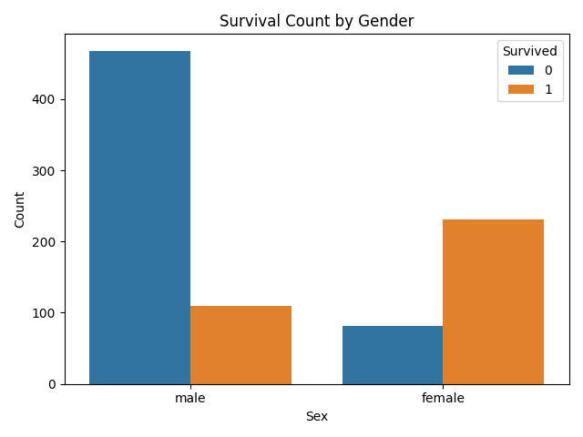
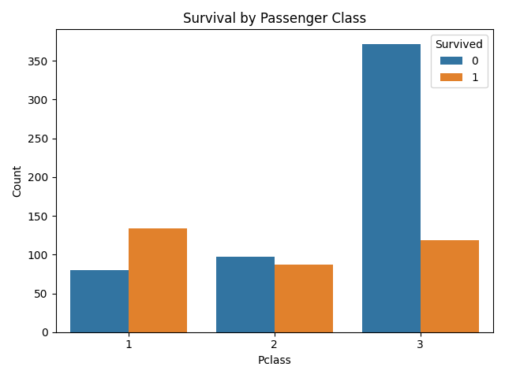
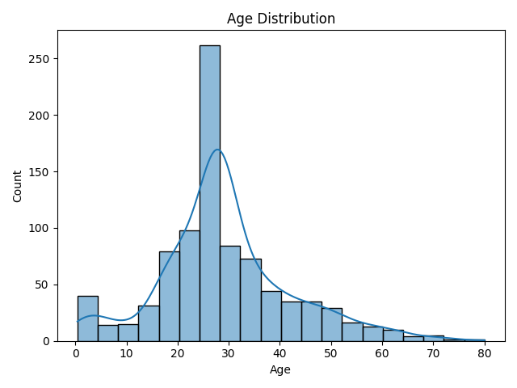

## Task 02: Exploratory Data Analysis (EDA) – Titanic Dataset

### 🎯 Objective:
Perform data cleaning and exploratory analysis to identify patterns and trends in the Titanic dataset.

---

### 📊 Key Explorations:
- Survival distribution (overall)
- Survival by gender
- Survival by passenger class (Pclass)
- Age distribution of passengers

---

### 🧠 Key Patterns & Trends Identified:
- **Females had a significantly higher survival rate** than males.
- **First-class passengers** were more likely to survive compared to second and third class.
- **Most passengers** were between ages **20–40**.
- A few **children and elderly passengers** also showed higher survival rates.

---

### 📈 Visual Outputs:
- 
- 
- 
- 

---

### 🛠️ Tools Used:
- Python
- Pandas
- Matplotlib
- Seaborn
