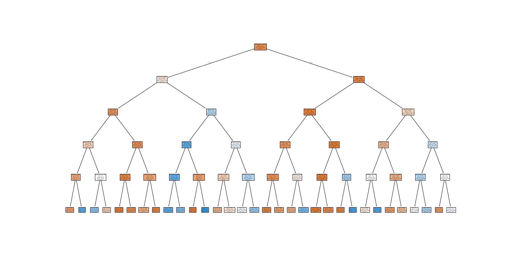

## 📊 CodeCraft Data Science Internship – Task 03

### 🎯 Task Objective
Build a Decision Tree Classifier to predict whether a customer will subscribe to a term deposit, using demographic and behavioral data from the Bank Marketing Dataset.

### 🗂️ Files Included
- `task03_decision_tree.py` – Script to build, train, and evaluate a decision tree classifier.
- `task03_decision_tree_plot.png` – Visual representation of the trained decision tree.

### 📦 Dataset Used
- [Bank Marketing Dataset (UCI)](https://archive.ics.uci.edu/ml/datasets/Bank+Marketing)

### 🛠️ Tools & Libraries Used
- Python
- Pandas
- Scikit-learn
- Matplotlib

### 📈 Outputs
- **Accuracy:** `91.49%`
- **Decision Tree Plot:**
  
Task 03 Completed ✅)

- **Classification Report:**
           precision    recall  f1-score   support

        0       0.94      0.96      0.95      7303
        1       0.65      0.54      0.59       935

  accuracy                           0.91      8238
 macro avg       0.80      0.75      0.77      8238
weighted avg 0.91 0.91 0.91 8238

### ✅ Status
Task 03 Completed ✅
