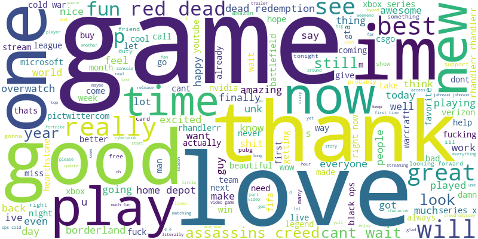
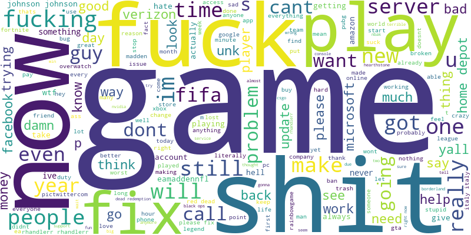
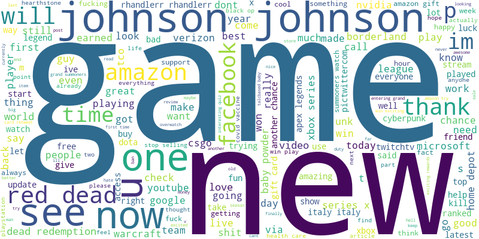

# CodeCraft Data Science Internship – Task 04

## 🎯 Task Objective

Analyze and visualize sentiment patterns in social media data (Twitter) to understand public opinion and attitudes towards specific topics or brands.

---

## 📁 Files Included

- `twitter_sentiment.py` – Python script that performs sentiment analysis and generates visualizations.
- `twitter_training.csv` – Dataset containing tweets with labeled sentiments.
- `twitter_validation.csv` – Additional validation dataset (not used in this task).
- `task04_sentiment_distribution.png` – Bar chart showing distribution of sentiments.
- `task04_wordcloud_Positive.png`, `task04_wordcloud_Negative.png`, `task04_wordcloud_Neutral.png` – Word clouds for each sentiment.

---

## 🛠️ Tools & Libraries Used

- Python
- Pandas
- Seaborn
- Matplotlib
- WordCloud
- re (regex for text cleaning)

---

## 📊 Outputs

- **Sentiment Distribution:**
  

- **Word Clouds by Sentiment:**
  - 
  - 
  - 

---

## 🧹 Key Steps Performed

1. **Loaded and merged training + validation data**
2. **Cleaned tweets** (removed URLs, mentions, hashtags, special characters)
3. **Analyzed sentiment frequency**
4. **Visualized with bar chart and word clouds**

---

## 📌 Dataset Source

- [Twitter Financial Sentiment Dataset](https://www.kaggle.com/datasets/cosmos98/twitter-financial-news-sentiment-analysis)

---

## ✅ Status

Task 04 Completed ✅
