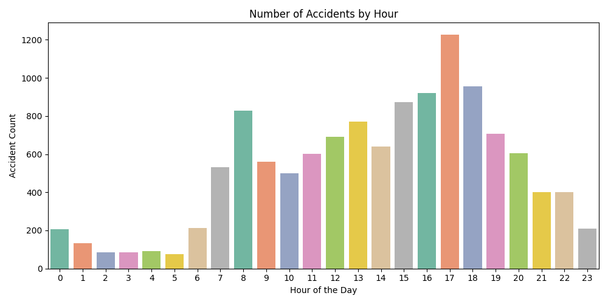
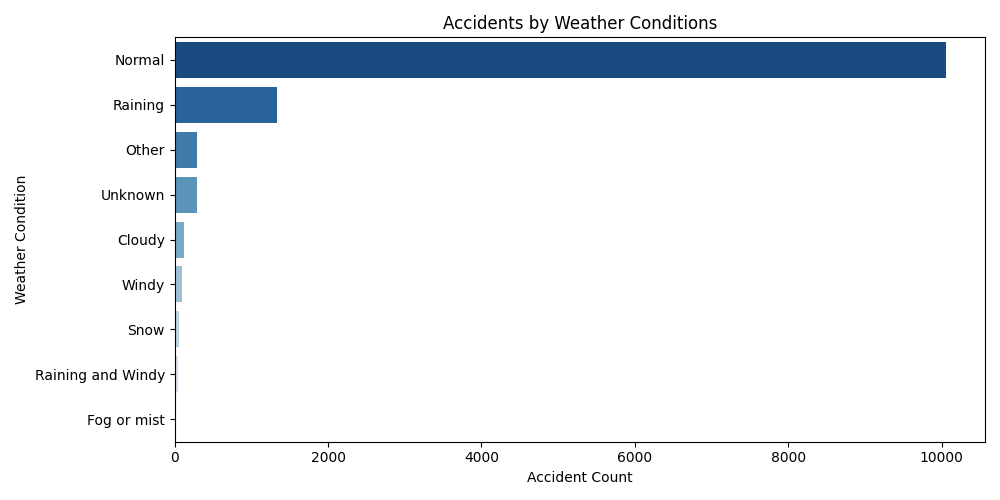
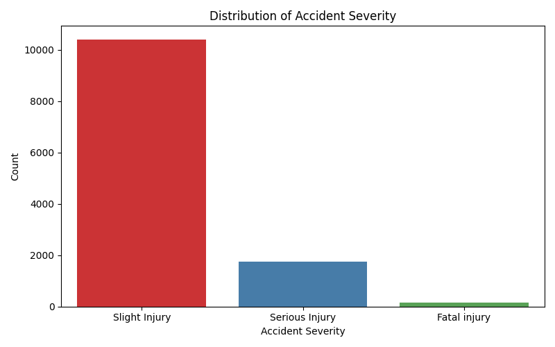
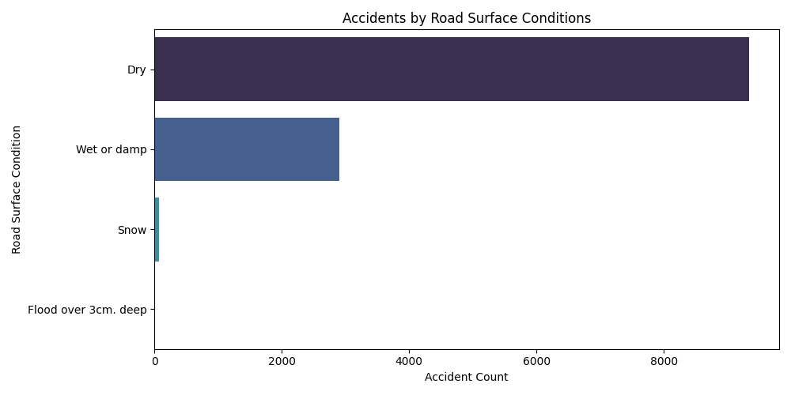
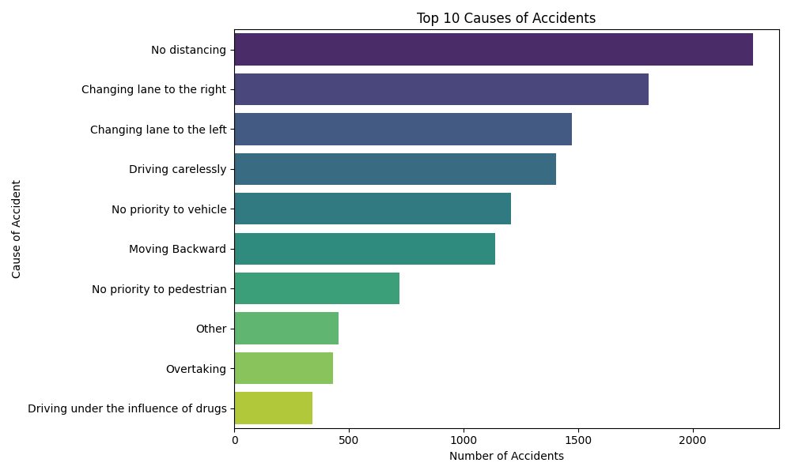

# CodeCraft Data Science Internship – Task 05

## 🎯 Task Objective

Analyze traffic accident data to identify patterns related to:
- Road conditions
- Weather conditions
- Time of day
- Accident severity
- Causes of accidents

---

## 📁 Files Included

- `road_traffic.py` – Python script to perform the analysis and generate visualizations.
- `RTA Dataset.csv` – Dataset containing accident records.
- Generated Visualization Outputs:
  - `task05_accidents_by_hour.png`
  - `task05_weather_conditions.png`
  - `task05_accident_severity.png`
  - `task05_road_surface_conditions.png`
  - `task05_top_causes.png`

---

## 🛠️ Tools & Libraries Used

- Python
- Pandas
- Seaborn
- Matplotlib

---

## 📊 Outputs

- **Number of Accidents by Hour of the Day:**
  

- **Accidents by Weather Conditions:**
  

- **Distribution of Accident Severity:**
  

- **Accidents by Road Surface Conditions:**
  

- **Top 10 Causes of Accidents:**
  

---

## 🧹 Key Steps Performed

1. Cleaned and preprocessed the accident data.
2. Extracted the hour from accident times for hourly analysis.
3. Visualized:
   - Accident frequencies by time of day
   - Weather conditions during accidents
   - Severity of accidents
   - Road surface conditions
   - Most frequent causes of accidents

---

## 📌 Dataset Source

- RTA Dataset (Uploaded manually)

---

## ✅ Status

Task 05 Completed ✅
